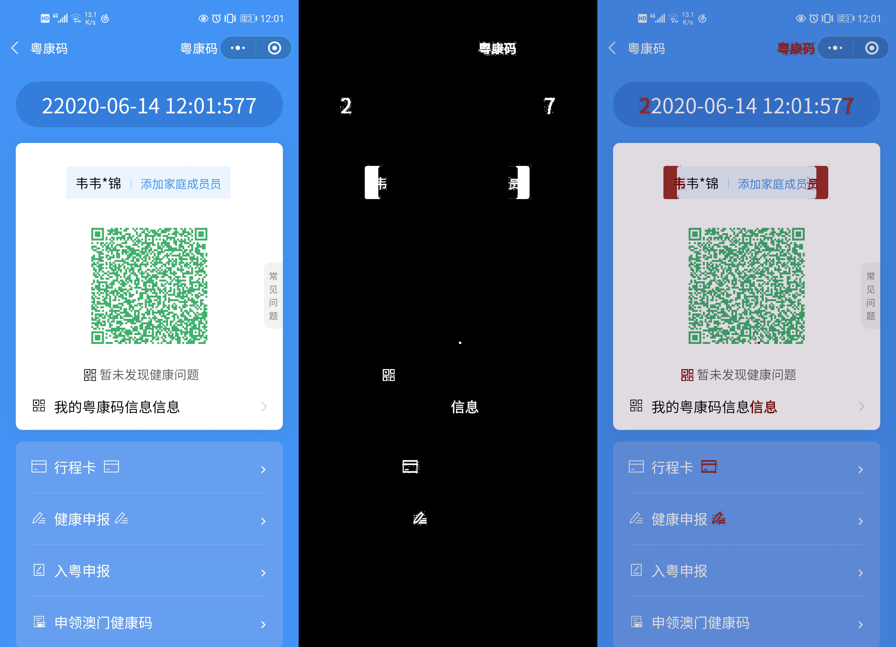
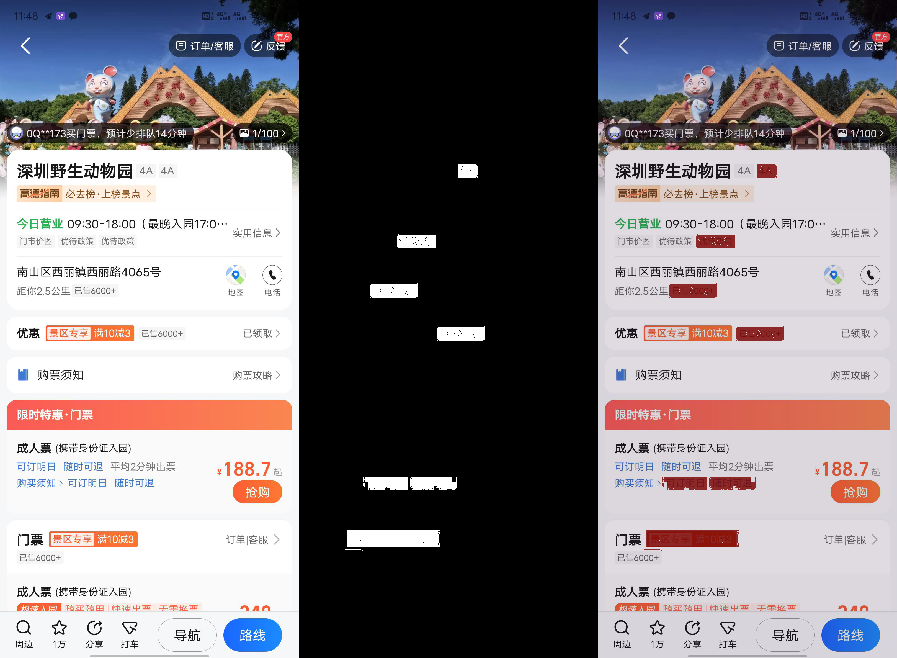
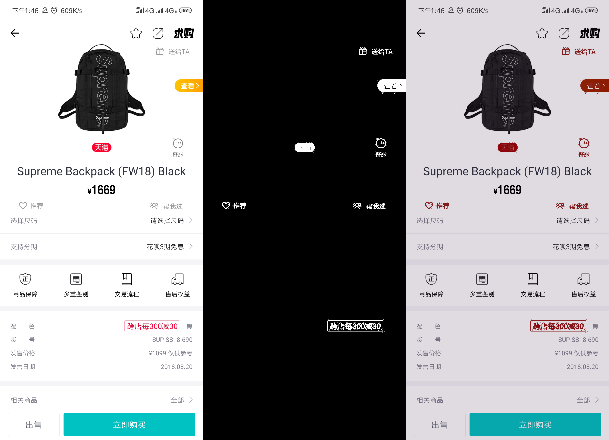
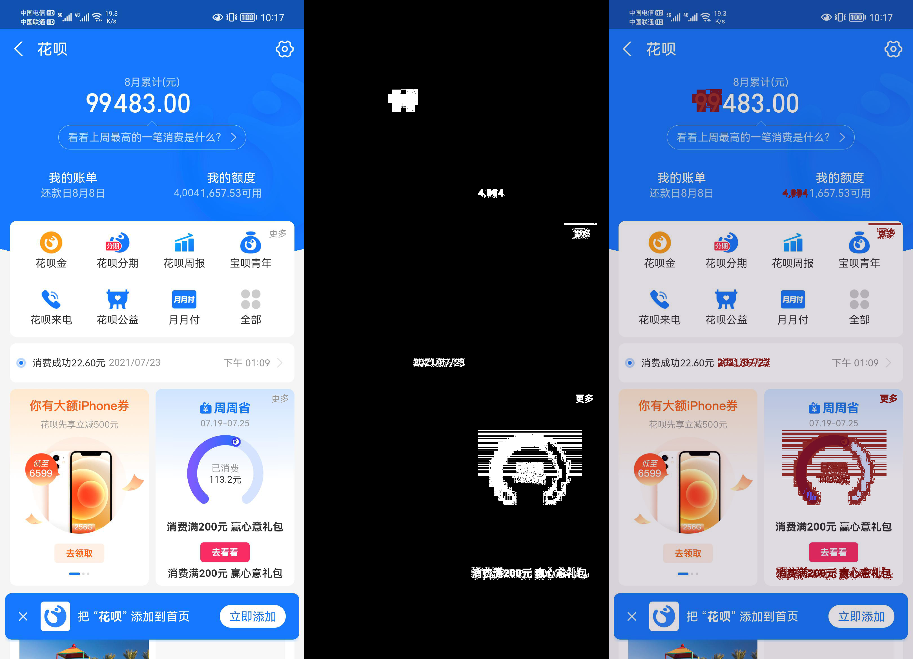
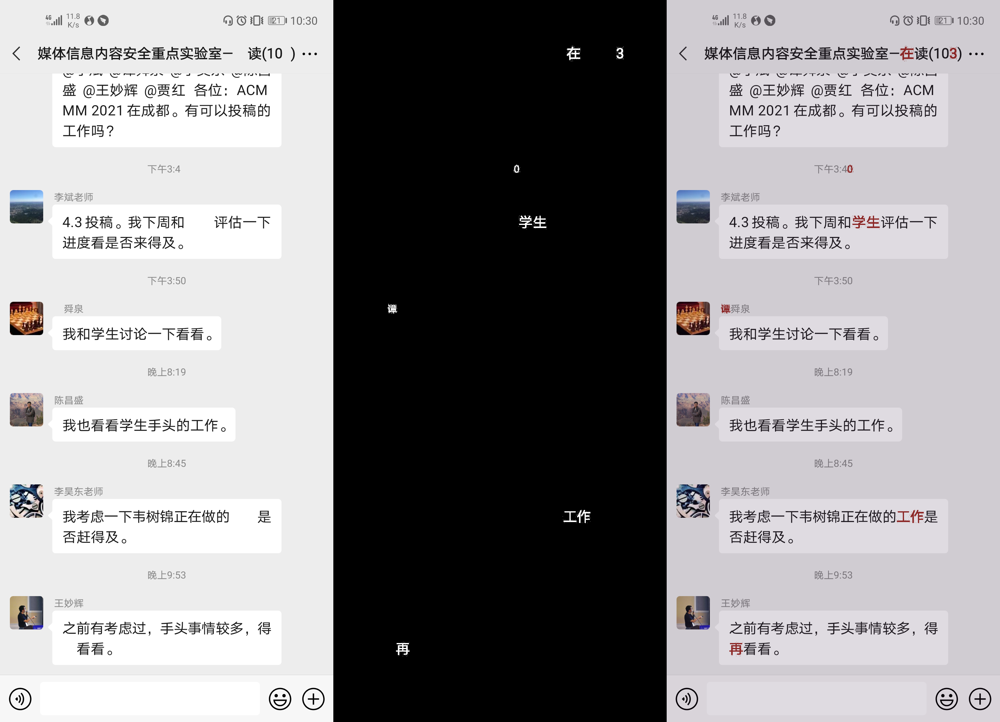
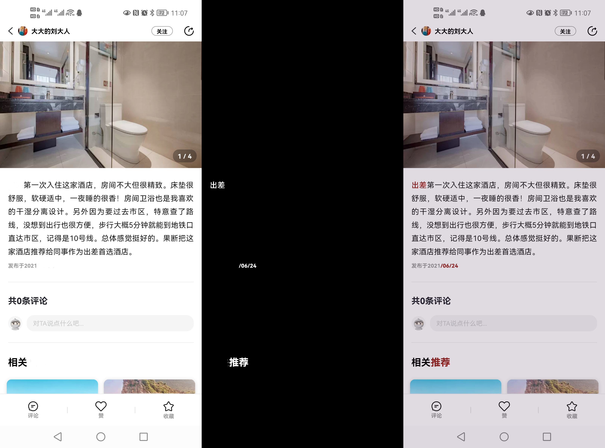
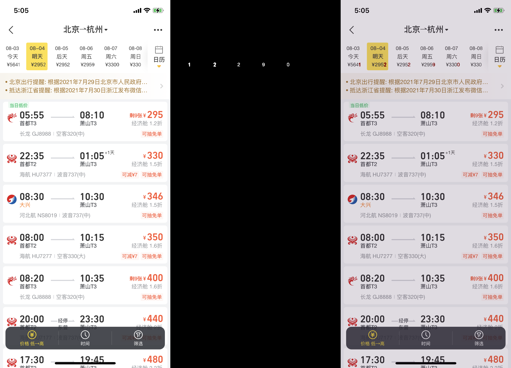
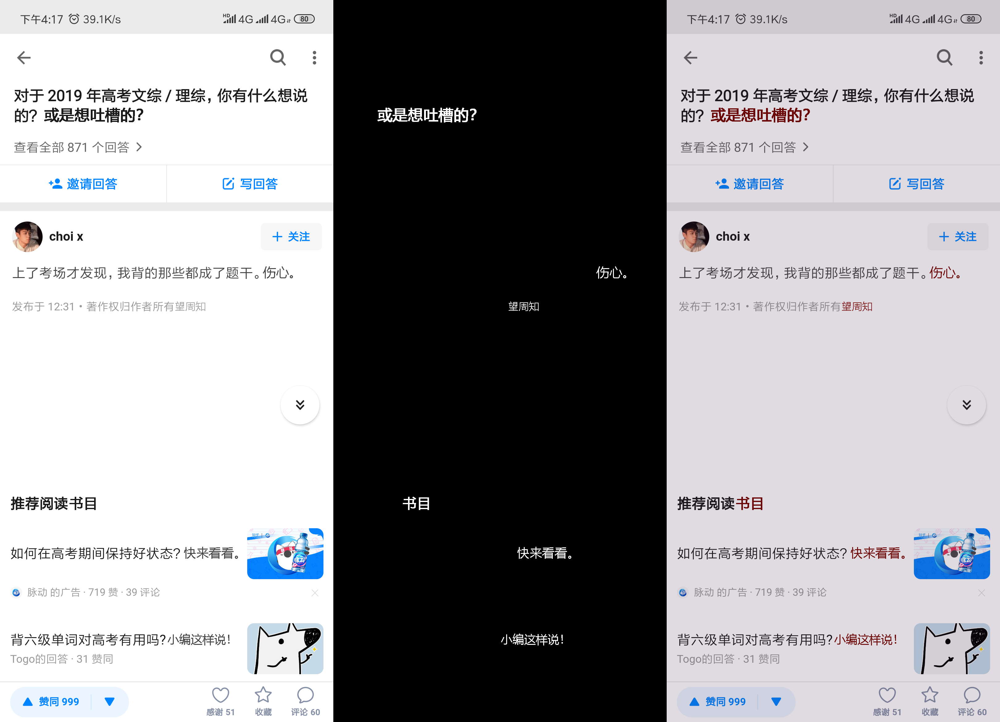

# STFL-Net and STFD

---

Official implementation of **STFL-Net** and the **STFD** dataset from our ICASSP 2023 paper “Learning to Locate the Text Forgery in Smartphone Screenshots”. <br>
[](https://github.com/ZeqinYu/STFL-Net) [](https://ieeexplore.ieee.org/abstract/document/10095070/) <br> 
Zeqin Yu, Bin Li, Yuzhen Lin, Jinhua Zeng, Jishen Zeng  

(_In collaboration with **Alibaba Security**_)

> - Parts of **STFD** were adopted in the <br>
>   □ ["2022 Real-World Image Forgery Detection Challenge" (真实场景篡改图像检测挑战赛)](https://tianchi.aliyun.com/competition/entrance/531945/introduction?spm=5176.12281949.1003.1.c90d2448TlNT6k).  
> - 🧐 *Funny story*: We discovered that another subset of **STFD** resurfaced in the ICDAR 2023 competitions under a different partnership, although the organizers have not publicly disclosed the source: <br>
>   □ ["DTT in Images 1: Text Manipulation Classification"](https://tianchi.aliyun.com/competition/entrance/532048/rankingList) and ["DTT in Images 2: Text Manipulation Detection"](https://tianchi.aliyun.com/competition/entrance/532052/introduction?spm=5176.12281957.0.0.4c885d9bYCL71E).  
> - **If you use data from any of these challenges, please cite our paper.**

---

> **TODO (coming soon!)** 
> - [ ] 📦 **Release STFL-Net code & checkpoints**
> - [ ] 🔗 **Publish full STFD dataset download links**

## Overview

### Screenshot Sources

| Category | Description |
|----------|-------------|
| Systems | Android, HarmonyOS, iOS, Windows |
| Scenes  | Chat, Social Media, Mobile Payment, E-commerce, Online Banking, Maps & Transportation, Web Browsing, System Interfaces, Documents|
| Devices | Realme Q3 Pro, Oppo Reno1, Honor 9, Honor V30, Vivo X21s, Samsung Note20 Ultra, Vivo X60, Honor 30-1, Xiaomi 9, Honor V20, Nova 8, OnePlus 9, Huawei Mate30, Honor 30-2, Honor 20 Pro, iPhone 7, iPad Air 3, iPad 2020, iPhone 12, iPhone XS, iPhone 11, iPhone SE2, iPhone 14 Pro, MacBook Air 2015, MacBook Pro 2017, Win10 Dell Optiplex 7080, Win11 Xiaomi Air14, Win10 Xiaomi Air14 |
| Format  | PNG / JPEG |

### Some Examples
#### Copy-Move
<p align="center">
  
  
</p>

#### Splicing
<p align="center">
  
  
</p>

#### Removal
<p align="center">
  
  
</p>

#### Insertion
<p align="center">
  
  
</p>

#### Replacement


### Dataset Structure
```text
STFD/
├── 1_Copy-move/
│   ├── tamper/   # tampered screenshots (copy-move)
│   └── masks/    # binary masks (same filename as tamper)
├── 2_Splicing/
│   ├── tamper/
│   └── masks/
├── 3_Removal/
│   ├── tamper/
│   └── masks/
├── 4_Insertion/
│   ├── tamper/
│   └── masks/
└── 5_Replacement/
    ├── tamper/
    └── masks/
```
---


## ✍️ Citation
```bibtex
@inproceedings{yu2023learning,
  title        = {Learning to Locate the Text Forgery in Smartphone Screenshots},
  author       = {Yu, Zeqin and Li, Bin and Lin, Yuzhen and Zeng, Jinhua and Zeng, Jishen},
  booktitle    = {ICASSP 2023–2023 IEEE International Conference on Acoustics, Speech and Signal Processing (ICASSP)},
  pages        = {1--5},
  year         = {2023},
  organization = {IEEE}
}

